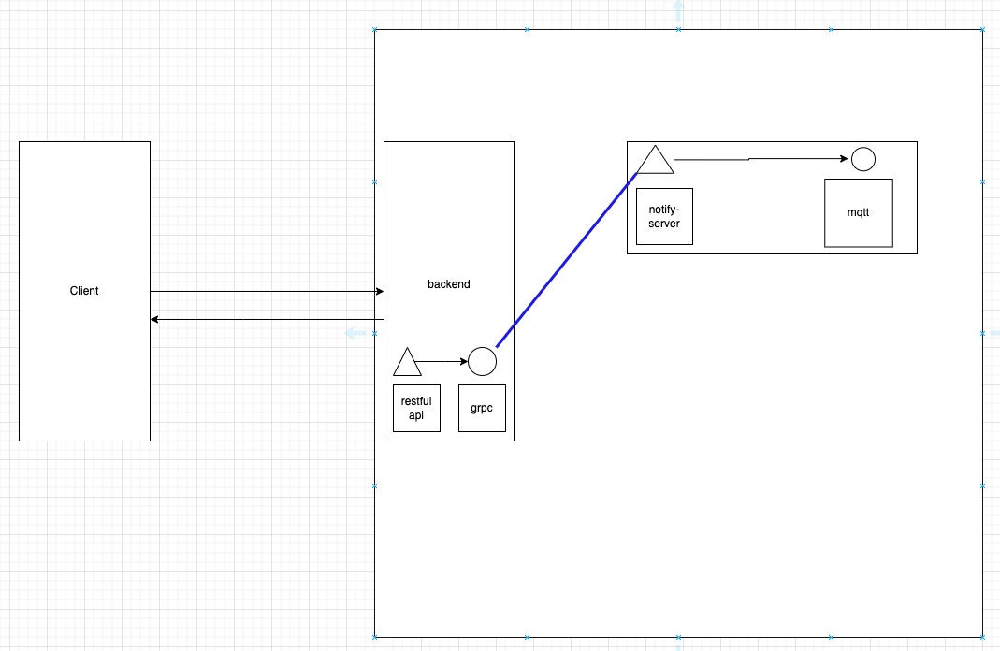

# 會員註冊通知

## 微服務專案

1. grpc-to-do-list
2. grpc-notify-server

## 會員註冊 - gin框架restful api  (repo : grpc-to-do-list)

- 目的

> 註冊帳號成功,透過grpc傳給*grpc-notify-server*

## 訊息通知 - grpc Server (repo: grpc-notify-server)

- 目的

> 接收想要傳送的訊息,給client端

## 架構圖

